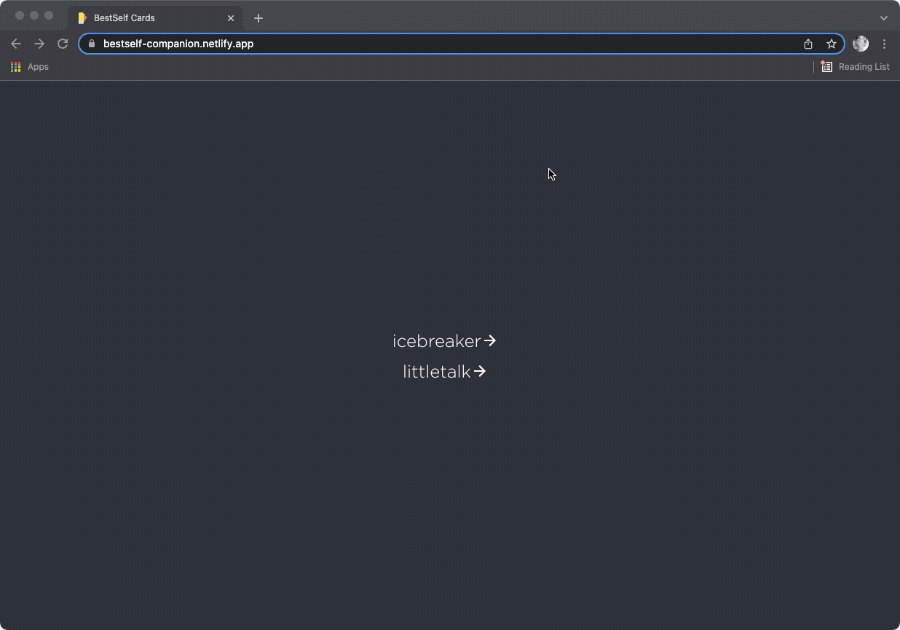

## Table of Contents
- [Table of Contents](#table-of-contents)
- [Cards](#cards)
  - [Courage](#courage)
  - [Edison](#edison)
  - [Icebreaker](#icebreaker)
  - [Intimacy](#intimacy)
  - [Little Talk](#little-talk)
  - [Words](#words)
- [Motivation](#motivation)
- [LIVE Demo](#live-demo)
- [Available Scripts](#available-scripts)
  - [`npm start`](#npm-start)
  - [`npm test`](#npm-test)
  - [`npm run build`](#npm-run-build)

## Cards
### Courage
Expand your comfort zone with 150 daily challenges that inspire personal growth and mindset shifts.  

- Empower yourself to crush big goals 
- Transform your relationship with fear and thrive in discomfort 
- Unlock your potential and become the best version of yourself
  
Available for purchase [here](https://bestself.co/products/courage-over-comfort-deck).

### Edison
A creative and easy to follow framework for generating great and innovative ideas.

- Empower yourself to think on your feet and generate great ideas 
- Push yourself to answer tough questions 
- Develop better thinking skills to solve any problem you face

Great to work through alone or with a friend.

Available for purchase [here](https://bestself.co/products/edison-deck).

### Icebreaker
A deck of 150 conversation prompts that spark meaningful discussions and strengthen relationships. With the Icebreaker Deck, you’ll:

- Move beyond small talk
- Break down barriers, cultivate connections, and cultivate openness and vulnerability
- Get to know people better across 6 categories: life, random, deep, experience, if you could…, and would you rather...

Perfect to use with friends, coworkers, family, and strangers. Select a card and start sharing.

Available for purchase [here](https://bestself.co/products/icebreaker-deck).

### Intimacy
The perfect addition to date night - 150 prompts to spark deeper and more meaningful conversations. 

- Reignite the intimate spark and fall in love again.  
- Get to know each other better by asking deeper questions. 
- Spend quality time together away and spice things up.  
- Carve out time to truly be present and connected with your partner.  
- Learn to speak each other’s love languages.

Available for purchase [here](https://bestself.co/products/intimacy-deck).

### Little Talk
Conversation starters for kids! Turn everyday moments into meaningful memories and spark bigger conversations with children and young people with these 150 prompt cards. 

- Connect with your kids and create quality family time too 
- Encourage self-expression 
- Inspire personal development from a young age 
- Cultivate self-acceptance and self-trust and help children feel seen and heard
  
Available for purchase [here](https://bestself.co/products/little-talk-deck).

### Words
Less writer's block, more writing! 150 prompts to stimulate the creative juices.

## Motivation

If, like me, you sometimes struggle to pick a category then this little random category generator build in React has got you covered. It’s super simple. Hit up the site, Press the spacebar and lean in. 

## LIVE Demo

The app is running [here](https://bestself-companion.netlify.app/). Check it out the for youself. Enjoy!

---

## Available Scripts

In the project directory, you can run:

### `npm start`

Runs the app in the development mode.\
Open [http://localhost:3000](http://localhost:3000) to view it in the browser.

The page will reload if you make edits.\
You will also see any lint errors in the console.

### `npm test`

Launches the test runner in the interactive watch mode.\
See the section about [running tests](https://facebook.github.io/create-react-app/docs/running-tests) for more information.

### `npm run build`

Builds the app for production to the `build` folder.\
It correctly bundles React in production mode and optimizes the build for the best performance.

The build is minified and the filenames include the hashes.\
Your app is ready to be deployed!

See the section about [deployment](https://facebook.github.io/create-react-app/docs/deployment) for more information.
